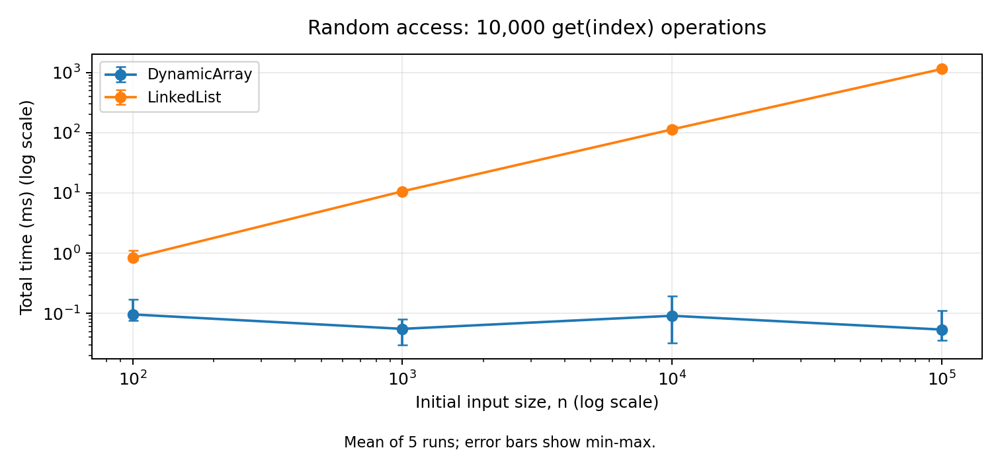
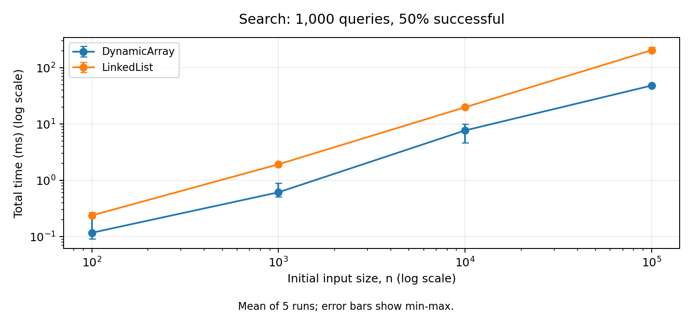
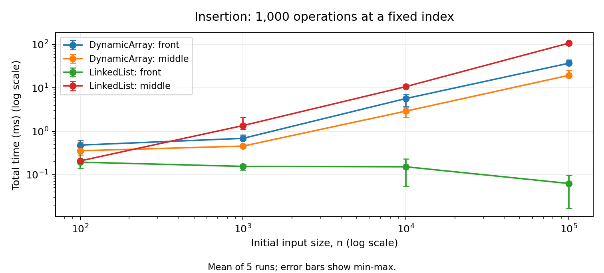
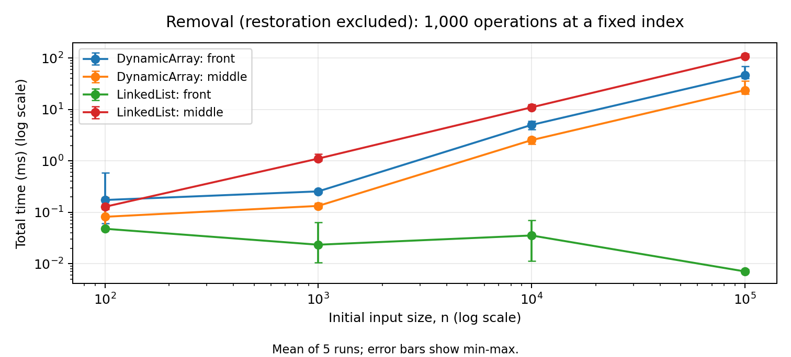
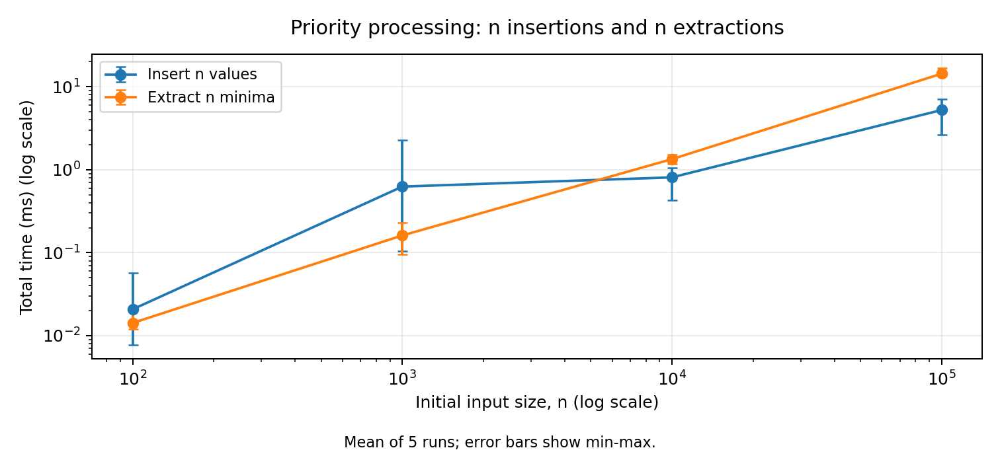
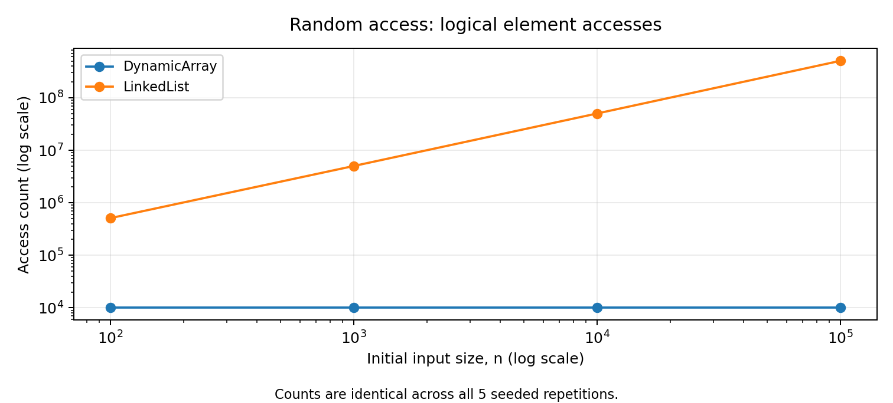
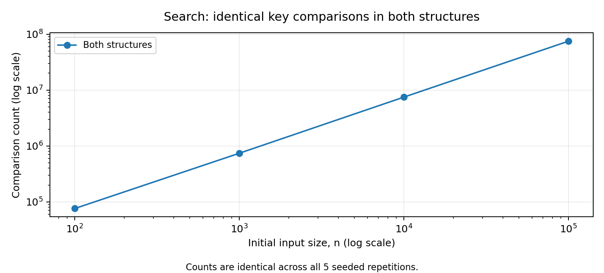
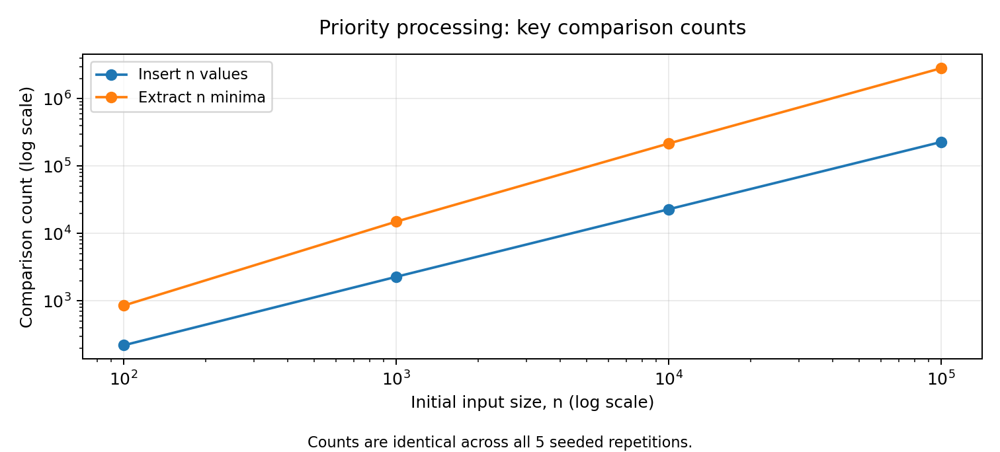

# Assignment 2: Java Data Structures

Start with `START_HERE.md`. Use `check.bat` on Windows for a safe test run.

## Assignment 2

Algorithmic Analysis, Correctness and Performance Trade-offs

Student: ____________________    Group: ____________________

## 1. Overview

This project compares a Dynamic Array, a Linked List, and a Min-Heap. The three structures are written in Java. They store integers. The aim is to explain how they work, prove two operations, and compare their speed using the four workloads in the assignment [1].

| Structure | How it stores values | Required methods |
| --- | --- | --- |
| Dynamic Array | An int array that doubles when full. | add(x), add(index, x), remove(index), get(index), contains(x) |
| Linked List | Nodes. Each node stores a value and a link to the next node. | add(x), add(index, x), remove(index), get(index), contains(x) |
| Min-Heap | An int array where every parent is <= its children. | insert(x), peekMin(), extractMin() |

### 1.1 Main ideas in the code

size is the number of stored values. Capacity is the length of the internal array. head is the first list node, and tail is the last. The array and heap start with space for 16 values. Neither one shrinks its array after removals.

IntList is a small interface: a shared list of methods for the two list classes. It lets the same test code work with either class. Metrics stores three counters: accesses, comparisons, and movements. Demo.java shows small examples before the larger tests.

The custom structures do not use ready-made collections as storage. Standard Java collections are used to check answers and to hold benchmark result records. The Java source has no streams, lambdas, recursion, or external libraries.

### 1.2 Tests and error handling

The tests check empty structures, one value, many values, duplicates, negative values, boundary positions, invalid indices, and 100,000-element inputs. They also check repeated array growth and list operations after the list becomes empty.

Array results are compared with ArrayList; list results with java.util.LinkedList; heap results with PriorityQueue and a sorted array. Mixed heap tests check the heap rule after every insertion and removal. The latest run passed 188,698 checks. Its output is saved in results/test-results.txt [3].

get and remove accept indices from 0 to size - 1. Insertion also accepts index size. Invalid indices throw IndexOutOfBoundsException. Reading or removing a minimum from an empty heap throws NoSuchElementException. These errors do not change the stored values.

## 2. Complexity Analysis

### 2.1 Meaning of the symbols

n means the number of values before one operation. m means the number of operations in a workload. O gives an upper growth bound. Ω gives a lower bound. Θ gives a matching upper and lower bound. For example, Θ(n) means both O(n) and Ω(n). These symbols are not names for worst, best, and average cases.

The analysis counts simple steps such as a comparison, an array access, or following a link. Average indexed operations assume a uniformly chosen valid index. Average search uses 50% present values and 50% absent values. Extra space means temporary working memory, not the stored data itself.

### 2.2 Dynamic Array

| Operation | Best | Average / sequence | Worst | Extra space |
| --- | --- | --- | --- | --- |
| add(x) | Θ(1) | Θ(1) amortized* | Θ(n) | Θ(n) on growth; otherwise Θ(1) |
| add(index, x) | Θ(1) | Θ(n) | Θ(n) | Θ(n) on growth; otherwise Θ(1) |
| remove(index) | Θ(1) | Θ(n) | Θ(n) | Θ(1) |
| get(index) | Θ(1) | Θ(1) | Θ(1) | Θ(1) |
| contains(x) | Θ(1) | Θ(n) | Θ(n) | Θ(1) |

get reads one position directly. contains checks values until it finds a match or reaches the end. Insertion shifts n - index values right. Removal shifts n - index - 1 values left. An operation at the end can avoid shifting. An operation near the front can move almost the whole array.

*Amortized means the cost per operation over a whole sequence, not over random input values. Doubling copies 16, 32, 64, and so on. Over N appends, all these copies together take O(N) steps. The N new writes also take Ω(N). So N appends take Θ(N), or Θ(1) per append. One append to a full array still takes Θ(n).

### 2.3 Linked List

| Operation | Best | Average | Worst | Extra space |
| --- | --- | --- | --- | --- |
| add(x) | Θ(1) | Θ(1) | Θ(1) | Θ(1) |
| add(index, x) | Θ(1) | Θ(n) | Θ(n) | Θ(1) |
| remove(index) | Θ(1) | Θ(n) | Θ(n) | Θ(1) |
| get(index) | Θ(1) | Θ(n) | Θ(n) | Θ(1) |
| contains(x) | Θ(1) | Θ(n) | Θ(n) | Θ(1) |

add(x) uses tail, so it does not scan the list. Head insertion and removal are also constant time. Other indexed operations usually need to follow links first. get(i) visits i + 1 nodes. Search checks nodes one by one. Changing two links is cheap, but finding the correct node by index may take Θ(n) time. Removing the tail also needs its previous node.

### 2.4 Min-Heap

| Operation | Best | Average / sequence | Worst |
| --- | --- | --- | --- |
| insert(x) | Θ(1) | Θ(1) expected amortized for random-order construction* | Θ(n) with growth; Θ(log n) without growth |
| peekMin() | Θ(1) | Θ(1) | Θ(1) |
| extractMin() | Θ(1) | Θ(log n), averaged over all removals of random distinct values* | Θ(log n) |

insert puts the new value at the end. It compares the value with its parent and swaps them when needed. Each swap moves one level up. A heap has about log2(n) levels, so the upward loop has a worst-case Θ(log n) cost. If the array is full, copying it adds Θ(n) time.

peekMin returns the root at data[0]. The root is the minimum because every parent is <= its children. extractMin saves the root, moves the last value to the root, and moves it down by swapping with the smaller child. It checks at most two key comparisons per level. The worst case is Θ(log n); an immediate stop can take Θ(1).

*The average insertion entry has a specific meaning. Inserting distinct values in random order into an empty heap takes expected Θ(n) total time [2]. With doubling, this gives expected amortized Θ(1) per insertion. It is not a guarantee for every insertion or every possible input. Descending input can take Θ(n log n) for all insertions. O(log n) amortized per insertion is a safe general bound.

Removing every minimum puts the values in sorted order. For random distinct values, a full drain has expected Θ(n log n) comparisons, or Θ(log n) per extraction averaged over the drain. The upper bound follows from the heap height. The lower bound follows from comparison sorting: sorting random distinct values needs Ω(n log n) comparisons, and the expected build phase takes only O(n).

### 2.5 Memory

Heap insertion uses Θ(n) extra memory when a larger array is made; otherwise it uses Θ(1). peekMin and extractMin use Θ(1) extra memory. The code uses loops rather than recursive calls.

The list stores Θ(n) nodes. The array and heap keep their allocated capacity after deletion. Therefore their retained memory follows their largest earlier size, not necessarily the current size. During growth, both the old and new arrays exist for a short time.

### 2.6 One operation versus a whole workload

For m random accesses, array work is Θ(m) and expected list work is Θ(mn). For m searches with half the values absent, both structures take expected Θ(mn). List head changes take Θ(m). List middle changes take Θ(mn), because each operation must reach the same fixed middle index.

Repeated array insertion grows the structure. At a fixed index i, the shifts are m(n - i) + m(m - 1)/2, plus any growth copies. This gives Θ(mn + m²), not simply Θ(mn) when m also changes. In this assignment m is fixed at 1,000 for these changes.

## 3. Correctness

A loop invariant is a statement that stays true each time a loop begins. A complete proof checks the start, each step, and the end. The following proofs refer to the actual loops in the Java source.

### 3.1 DynamicArray.add(index, value)

Before insertion, size is s and index is between 0 and s. Call the original values A[0] to A[s - 1]. ensureCapacity keeps those values and makes room for one more. Counter updates are omitted from this short code extract; they do not change any stored value.

```
for (int i = size; i > index; i--) {
    data[i] = data[i - 1];
}
data[index] = value;
size++;
```

Invariant: at the start of a step with position i, index <= i <= s. Every position k below i still contains A[k]. Every position k above i, up to s, contains A[k - 1]. So the processed right part has moved one place right, and the unread left part is unchanged.

Initialization: i starts at s. No values have moved yet. The unchanged part is the full original array, and the processed part is empty. The invariant is true.

Maintenance: data[i - 1] is still the original value A[i - 1]. Copying it to data[i] puts that value in its correct new place. Decreasing i by one adds this position to the processed part. The remaining unread values are unchanged, so the invariant stays true.

Termination: i - index decreases by one and cannot go below zero during the loop. The loop stops at i = index. All original values from index onward have moved right once. Earlier values are unchanged. Writing the new value at index and increasing size creates the required sequence without losing or reordering the old values. End insertion is also covered: its loop runs zero times.

### 3.2 LinkedList.contains(value)

Precondition: the list is valid and has a finite chain of nodes. current starts at head. The loop reads current.value, returns true on a match, and otherwise moves to current.next.

Invariant: every node before current has already been checked and does not contain the target. current is the next node to check, or null when there are no nodes left. No value or link has changed.

Initialization: current is head. There are no earlier nodes, so the invariant is true. It also holds for an empty list, where head is null.

Maintenance: a match proves the value exists, so returning true is correct. Without a match, moving to the next node adds one known non-matching node to the checked part. The invariant stays true.

Termination: each unsuccessful step leaves one fewer node to check. Since the list is finite and valid, the loop either returns true or reaches null. At null, every node has been checked and none matched, so returning false is correct. Thus the method returns true exactly when the target is present, including lists with duplicates.

## 4. Experimental Setup

The four input sizes are 100, 1,000, 10,000, and 100,000. Every experiment is repeated five times. The reported time is the arithmetic mean: add the five times and divide by five. System.nanoTime() measures the operation loops. Results are then converted to milliseconds.

| Workload | Structures | Operations per experiment |
| --- | --- | --- |
| 1. Random access | Array and list | 10,000 get(index) calls |
| 2. Search | Array and list | 1,000 contains(value) calls |
| 3. Insert / remove | Array and list | 1,000 separate insertions or removals at 0 or fixed n / 2 |
| 4. Priority processing | Heap | n insertions into an empty heap, then n extractions |

Random(42) is used for each input size. Values 0 to n - 1 are shuffled into a random order. They are distinct, not independently sampled with replacement. Access indices, 1,000 new insertion values, and search values are prepared before timing. Exactly 500 search values are present and 500 are absent. Both structures and all five runs use the same prepared input.

Input generation, list filling, printing, restoration, and answer checks are outside the timer. Array growth, new list nodes, and counter updates caused by the measured operations are inside it. Two unrecorded warm-up rounds run at n = 1,000 first. The order of the two list structures changes between repetitions.

### 4.1 What the counters mean

Array accesses count slot reads and writes. Moving one existing value counts one movement and two accesses. Growth copies are included. List accesses count visited or directly handled nodes, including a new or removed node. List movements are zero because existing values are not shifted. These are different units, not equal CPU instructions.

Comparisons count value checks in contains or comparisons between heap keys. Index checks and loop conditions are not included. Heap comparisons are counted, but heap accesses are not: a zero access field for the heap means unused, not no memory work. All counters use long.

### 4.2 Workload 3: the small-size problem

The brief asks for 1,000 removals after restoring n original values [1]. For n = 100, this is impossible in one list. With the fixed middle index, n = 1,000 also allows only 500 removals before that index becomes invalid.

The code removes as many values as are valid, restores the original structure outside the timer, and continues until 1,000 successful removals are complete. It adds only the measured removal times and counts. The index stays 0 or the original n / 2. This interpretation needs the instructor's approval; it is not silently treated as an exact instruction from the brief.

| n | Front batches | Middle index | Middle batches |
| --- | --- | --- | --- |
| 100 | 10 | 50 | 20 |
| 1,000 | 1 | 500 | 2 |
| 10,000 | 1 | 5,000 | 1 |
| 100,000 | 1 | 50,000 | 1 |

A batch includes one prepared structure. All insertions start from a separate original structure. Measurements were made in a shared Linux container with OpenJDK 21, not on the student's computer. Full version and memory details are in results/environment.txt. Times may vary because of Java warm-up, scheduling, and memory use [3].

## 5. Results

The files contain 280 measured runs and 56 averages. Each table row is the total time for one workload, averaged over five runs. All values below come from the current CSV files [3]. Array and List mean the custom Java classes.

### 5.1 Workload 1: random access

| n | Type | Mean ms | Accesses | Total time bound |
| --- | --- | --- | --- | --- |
| 100 | Array | 0.095906 | 10,000 | Θ(m) |
| 100 | List | 0.831234 | 511,261 | Θ(mn), expected |
| 1,000 | Array | 0.055277 | 10,000 | Θ(m) |
| 1,000 | List | 10.593815 | 5,021,758 | Θ(mn), expected |
| 10,000 | Array | 0.091211 | 10,000 | Θ(m) |
| 10,000 | List | 113.106179 | 50,177,030 | Θ(mn), expected |
| 100,000 | Array | 0.053788 | 10,000 | Θ(m) |
| 100,000 | List | 1137.134463 | 505,044,105 | Θ(mn), expected |



At n = 100,000, the array takes 0.053788 ms and the list takes 1137.134463 ms. The array always makes 10,000 slot accesses. The list makes 505,044,105 node visits at the largest size.

The array jumps directly to an index. The list starts from head each time. A random list index needs about (n + 1) / 2 node visits on average. The counts therefore agree with Θ(1) array access and expected Θ(n) list access. Small timing changes do not change these bounds.

## 5.2 Workload 2: search

m = 1,000. Half of the search values are present and half are absent. Both structures hold values in the same order and receive the same queries.

| n | Type | Mean ms | Comparisons | Total time bound |
| --- | --- | --- | --- | --- |
| 100 | Array | 0.117265 | 75,912 | Θ(mn), expected |
| 100 | List | 0.238080 | 75,912 | Θ(mn), expected |
| 1,000 | Array | 0.613368 | 740,571 | Θ(mn), expected |
| 1,000 | List | 1.927573 | 740,571 | Θ(mn), expected |
| 10,000 | Array | 7.706681 | 7,478,562 | Θ(mn), expected |
| 10,000 | List | 19.888828 | 7,478,562 | Θ(mn), expected |
| 100,000 | Array | 48.324978 | 74,864,907 | Θ(mn), expected |
| 100,000 | List | 205.394460 | 74,864,907 | Θ(mn), expected |



At n = 100,000, both structures make 74,864,907 comparisons. The array takes 48.324978 ms; the list takes 205.394460 ms.

A successful search uses about (n + 1) / 2 comparisons on average. A failed search uses n. This explains the near-linear growth in the count when n increases. Equal comparison counts do not mean equal time: following next links and reading adjacent array positions have different costs.

## 5.3 Workload 3A: insertion

m = 1,000. Front means index 0. Middle means the fixed original n / 2. The metric is moved values for the array and handled nodes for the list. Array growth copies are included.

| n | Position | Type | Mean ms | Metric | Total bound |
| --- | --- | --- | --- | --- | --- |
| 100 | Front | Array | 0.481488 | 601,420 | Θ(mn + m²) |
| 100 | Front | List | 0.194483 | 1,000 | Θ(m) |
| 100 | Middle | Array | 0.356207 | 551,420 | Θ(mn + m²) |
| 100 | Middle | List | 0.208040 | 51,000 | Θ(mn) |
| 1,000 | Front | Array | 0.688234 | 1,500,524 | Θ(mn + m²) |
| 1,000 | Front | List | 0.155495 | 1,000 | Θ(m) |
| 1,000 | Middle | Array | 0.456444 | 1,000,524 | Θ(mn + m²) |
| 1,000 | Middle | List | 1.356892 | 501,000 | Θ(mn) |
| 10,000 | Front | Array | 5.699285 | 10,499,500 | Θ(mn + m²) |
| 10,000 | Front | List | 0.152341 | 1,000 | Θ(m) |
| 10,000 | Middle | Array | 2.920180 | 5,499,500 | Θ(mn + m²) |
| 10,000 | Middle | List | 10.732517 | 5,001,000 | Θ(mn) |
| 100,000 | Front | Array | 37.120313 | 100,499,500 | Θ(mn + m²) |
| 100,000 | Front | List | 0.062805 | 1,000 | Θ(m) |
| 100,000 | Middle | Array | 19.517181 | 50,499,500 | Θ(mn + m²) |
| 100,000 | Middle | List | 107.672069 | 50,001,000 | Θ(mn) |



The array shifts values to make space. Head insertion in the list only changes links, so it is cheaper in number of steps. Middle insertion in the list still needs a walk from head. The array grows during the 1,000 insertions, which is why its full bound includes m².

## 5.4 Workload 3B: removal

Each row has 1,000 successful removals. Small structures are restored outside timing as explained in Section 4.2. The counter units are the same as in the insertion table.

| n | Position | Type | Mean ms | Metric | Batches | Total bound |
| --- | --- | --- | --- | --- | --- | --- |
| 100 | Front | Array | 0.173249 | 49,500 | 10 | Θ(mn) |
| 100 | Front | List | 0.047745 | 1,000 | 10 | Θ(m) |
| 100 | Middle | Array | 0.081601 | 24,500 | 20 | Θ(mn) |
| 100 | Middle | List | 0.127822 | 51,000 | 20 | Θ(mn) |
| 1,000 | Front | Array | 0.254867 | 499,500 | 1 | Θ(mn) |
| 1,000 | Front | List | 0.023365 | 1,000 | 1 | Θ(m) |
| 1,000 | Middle | Array | 0.132875 | 249,500 | 2 | Θ(mn) |
| 1,000 | Middle | List | 1.107617 | 501,000 | 2 | Θ(mn) |
| 10,000 | Front | Array | 5.009604 | 9,499,500 | 1 | Θ(mn) |
| 10,000 | Front | List | 0.035335 | 1,000 | 1 | Θ(m) |
| 10,000 | Middle | Array | 2.532929 | 4,499,500 | 1 | Θ(mn) |
| 10,000 | Middle | List | 11.012722 | 5,001,000 | 1 | Θ(mn) |
| 100,000 | Front | Array | 46.483504 | 99,499,500 | 1 | Θ(mn) |
| 100,000 | Front | List | 0.007056 | 1,000 | 1 | Θ(m) |
| 100,000 | Middle | Array | 23.745779 | 49,499,500 | 1 | Θ(mn) |
| 100,000 | Middle | List | 107.667496 | 50,001,000 | 1 | Θ(mn) |



Front removal shifts almost all remaining array values. The list can just move head to the next node. In the middle, the array shifts fewer values, but the list still needs to find the previous node. The array bound shown here uses the documented batch rule and the tested sizes.

## 5.5 Workload 4: priority processing

The heap starts empty. It receives n values, then returns the minimum n times. These two parts have separate timers and comparison counters. The returned sequence is compared with a sorted copy of the input outside the timer.

| n | Phase | Mean ms | Comparisons | Total time bound |
| --- | --- | --- | --- | --- |
| 100 | Extract | 0.014232 | 855 | Θ(n log n), expected |
| 100 | Insert | 0.020782 | 220 | Θ(n), expected |
| 1,000 | Extract | 0.161368 | 15,018 | Θ(n log n), expected |
| 1,000 | Insert | 0.625535 | 2,281 | Θ(n), expected |
| 10,000 | Extract | 1.340480 | 216,624 | Θ(n log n), expected |
| 10,000 | Insert | 0.807918 | 22,918 | Θ(n), expected |
| 100,000 | Extract | 14.342128 | 2,831,730 | Θ(n log n), expected |
| 100,000 | Insert | 5.236890 | 227,941 | Θ(n), expected |



At n = 100,000, insertion makes 227,941 comparisons and extraction makes 2,831,730. The mean times are 5.236890 ms and 14.342128 ms.

Random-order insertion often stops after only a few upward comparisons. Repeated extraction usually moves values farther down. This agrees with the random-order averages in Section 2.4. Both phases have O(n log n) worst-case total bounds, including array growth. All extracted sequences passed the non-decreasing-order check.

peekMin is tested and analyzed, but it is not separately timed because this workload asks for insertion and extraction times only.

## 5.6 Operation-count graphs

These graphs show work counts rather than speed. Logarithmic axes keep small and large values readable. The exact numbers are in the tables and CSV files.







Counts are identical across the five runs because the input is fixed. verify_results.py checks averages, repeat counts, search hits, and exact insertion/removal counts. These checks passed for all 56 experiments [3].

## 6. Discussion

### 6.1 How does increasing n affect the workloads?

Array access keeps the same number of steps. List access and both searches do more work. Array front changes shift more values. List head changes stay cheap. Middle list changes need more link visits. Heap extraction has more levels to check.

### 6.2 Which results agree with the theory?

Array access always counts 10,000 reads. List head changes always count 1,000 handled nodes. List middle changes count 1,000(n / 2 + 1) nodes. Search counts and array movement counts follow their expected formulas. Heap comparison growth matches the random-order analysis.

### 6.3 Where do time results differ from a simple prediction?

Array access has a mean of 0.095906 ms at n = 100 and 0.053788 ms at n = 100,000, even though the access count is equal. Small timings can vary because of Java compilation, scheduling, and memory effects. These causes were not measured separately. None of the observed runs was removed.

### 6.4 Why can the same Big-O give different times?

Big-O does not show every small cost. Both searches are linear, but an array reads nearby slots while a list follows links. The tables show equal comparisons but different times. This does not contradict the analysis.

### 6.5 What implementation details matter?

tail makes list append constant time. Doubling makes most array appends cheap but creates occasional long copies. List insertion creates a node. The counters also add work inside the timer, so these measurements describe this instrumented code.

### 6.6 When is a Dynamic Array useful?

It is useful when indexed reads are common. It gives direct access and cheap amortized appends. It was also faster than the list for search and for large middle-index changes in this run. Repeated front changes are its main weakness here.

### 6.7 When is a Linked List useful?

It is useful for frequent head insertion and removal. Linking at a known node is also cheap. However, this project takes numeric indices, so it must first find an interior node. List insertion is not always constant time.

### 6.8 Why use a heap for priority processing?

The minimum is at the root, and removal fixes one path. Removing all minima has O(n log n) worst-case work. Repeatedly scanning an unsorted collection would take Θ(n²) checks in total. A heap is not a fully sorted array.

### 6.9 How does the workload affect the choice?

Choose for the operations that happen most often, not for one attractive complexity value. Indexed reading, head changes, and next-minimum processing need different strengths. These tests use one seed and four sizes; they support the analysis but do not prove speed for every program or computer.

## 7. Design Recommendations

| Main task | Structure | Reason |
| --- | --- | --- |
| Read by index | Dynamic Array | Direct access without following links. |
| Search an unsorted sequence | Dynamic Array here | Both are linear; the array was faster in these runs. |
| Insert/remove at the front | Linked List | Change head without shifting other values. |
| Change a middle numeric index | Dynamic Array here | Both are linear; list traversal was slower at larger sizes. |
| Repeatedly take the minimum | Min-Heap | Direct minimum lookup and short repair paths. |

## 8. Conclusion

No structure is best for every job. The Dynamic Array is strong for indexed access. The Linked List is strong for head changes. The Min-Heap is useful for priority processing. Counts agree with the main complexity bounds, while measured times also depend on small implementation and computer effects.

All required methods and tests are included. The two proofs cover indexed array insertion and list search. The Workload 3 removal rule still needs the instructor's approval. The GitHub repository also needs to be published before submission.

### Appendix: running and submitting

On Windows, run check.bat first. It compiles the source, runs Demo, and runs Tests. It does not replace the saved measurements. A JDK is needed; this project was tested with JDK 21. On macOS/Linux use sh check.sh.

run.bat or sh run.sh starts the full benchmark and replaces the result CSV files. Run it in a copy of the project to keep the supplied results unchanged. To rebuild all graphs and documents after new measurements, use the optional Python scripts:

```
python -m pip install matplotlib python-docx
python scripts/verify_results.py
python scripts/make_plots.py
python scripts/build_report.py
```

The brief asks for tables, graphs, an individual report, and a GitHub repository link. It does not separately require screenshots [1]. A screenshot of your own successful test run can be added as extra evidence, but it does not replace the source files or results.

The ZIP includes the existing local development history and the actual simplification changes. These assistant-prepared commits are not past work done by the student. Publish honestly under your authorized account; see docs/PUBLISHING.md. Review the code and fill in the name and group before submission.

### Sources

[1] Supplied Assignment 2-1.pdf, Sections 3-14. Source of the requirements.

[2] Bollobás, B., and Simon, I. (1985). Repeated random insertion into a priority queue. Journal of Algorithms 6(4), 466-477. DOI: 10.1016/0196-6774(85)90028-8. Source of the random-order expected heap construction result.

[3] This project: src/*.java, results/tables/raw.csv, summary.csv, test-results.txt, benchmark-log.txt, verification.txt, and environment.txt. Source of the tests, measurements, and checks. Proofs and workload explanations follow the supplied code.

